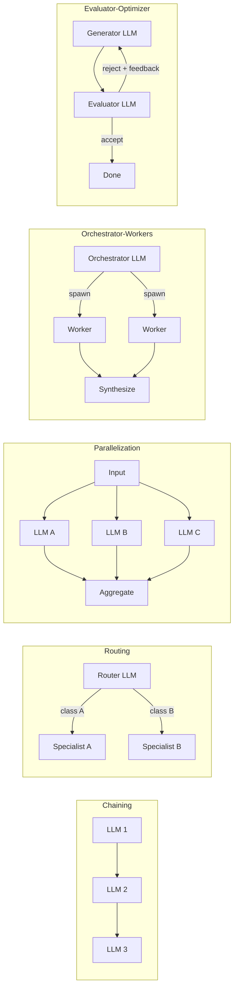
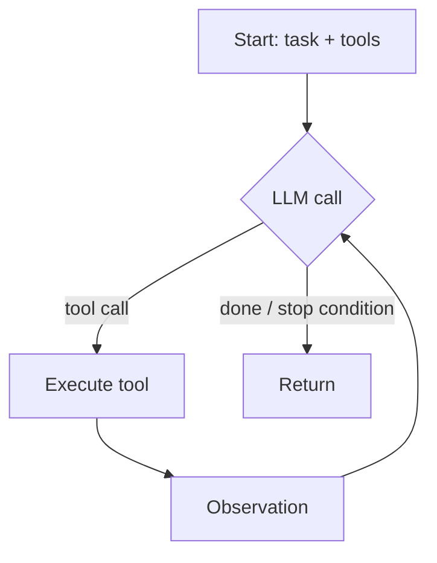

# Agent Patterns vs Frameworks — When to reach for what

## TL;DR

- "Agent" is overloaded. Anthropic's taxonomy is the cleanest 2026 vocabulary: distinguish **workflows** (LLM calls in a known control flow) from **agents** (LLM driving its own control flow with tool feedback).
- Most production "agentic" systems are workflows in disguise — and that's a feature. Workflows are predictable, debuggable, and cheaper.
- The five canonical workflow patterns (chaining, routing, parallelization, orchestrator-workers, evaluator-optimizer) cover the majority of real use-cases. Internalize these before reaching for any framework.
- Reach for an agent (true LLM-driven loop) only when the task's path can't be predicted in advance — open-ended research, multi-step debugging, codegen across files. Pay the predictability tax knowingly.
- Frameworks (LangGraph, Pydantic AI) earn their keep when you need durable state across long-running runs, deterministic replay, or cross-process orchestration. Not before.

## Where you started

(In a real session this section captures the learner's mental model entering the conversation — what they already believed and where the fuzziness lived. For this reference artifact: imagine an experienced backend engineer who has shipped LLM-backed features but has not built anything they'd call an "agent," and has been confused by the 2024–25 framework sprawl.)

## The problem

Before any taxonomy: *what's the underlying problem* an "agent" is solving?

A naive LLM call takes input → returns output. That's enough for many tasks (summarize, classify, draft). It falls over when:

1. **The task has dependent steps** where step N's prompt needs step N-1's output. (One LLM call → many.)
2. **The task needs information the model doesn't have** — current data, internal docs, computation results. (LLM + tools.)
3. **The task's path can't be enumerated in advance** — the system must decide what to do next based on intermediate results. (LLM driving control flow.)

The first two are *workflows*: the engineer designs the control flow; the LLM is a smart node in it. The third is what Anthropic calls an *agent*: the LLM is the controller.

The failure mode if you don't internalize this distinction: you reach for "an agent framework" for a problem that's actually a 4-call workflow. You inherit the framework's complexity tax (state machines, durable runs, agent-tool-message ceremony) for a system that would have been 50 lines of plain Python with explicit calls. You then have a hard time debugging it because the control flow is implicit.

## The patterns

### Workflow patterns (Anthropic taxonomy)

Five patterns. Each is a known control-flow shape with LLM calls as nodes.

*Figure: The five Anthropic workflow patterns, in order of increasing dynamism.*



**1. Chaining** — sequential LLM calls; output of one is input to the next. Use when you can decompose the task into known steps. Example: "summarize document → extract action items from summary → format as email." Predictable, debuggable, no surprises.

**2. Routing** — a small router LLM classifies the input, then dispatches to a specialist call. Use when the input space has clear sub-types and specialists do better than a generalist. Example: support ticket triage to billing-specialist vs technical-specialist vs escalate.

**3. Parallelization** — fan out the same (or related) call to N parallel LLMs, aggregate. Two flavors: *sectioning* (split the task) and *voting* (multiple votes for robustness). Use for independent subtasks or to trade tokens for reliability.

**4. Orchestrator-Workers** — a controller LLM dynamically decides how to split the work and spawns worker calls. Like Parallelization but the *split* is decided at runtime. Use when subtasks aren't known in advance. Common for codegen-across-files.

**5. Evaluator-Optimizer** — a generator LLM produces output, an evaluator LLM critiques, the loop iterates until the evaluator accepts (or budget is hit). Use when you can specify "good" but can't generate it in one shot. Common for translation, complex prose, structured generation with constraints.

### The agent pattern

*Figure: Agent loop. The LLM drives control flow; the environment provides feedback.*



A single loop: LLM proposes an action (tool call or final answer); the environment executes the action; the result feeds back into the next LLM call; loop until the LLM emits a stop signal or a budget is hit.

This is what people usually mean by "agent." Note what makes it different from the workflows: *the path through the call graph is decided at runtime by the LLM*. You don't write the control flow; you provide tools and a stopping condition.

When to reach for it: open-ended research, multi-step code editing, debugging where you don't know which file the bug is in. When to NOT reach for it: anything where you can specify the steps. The agent loop's flexibility comes at the cost of predictability — you trade lines of code for compute and latency variance.

### Faded example — your turn

Take this problem: *"Given a 200-page PDF, produce a slide deck summary highlighting the 5 most important findings."*

Which Anthropic pattern fits, and why? What's the alternative pattern, and what would it cost you?

(Spend 60 seconds on this before reading on.)

---

A reasonable answer: **Orchestrator-Workers**. The orchestrator splits the PDF into sections (or has the model decide the split); each section gets a worker that extracts findings; a final synthesis call ranks and produces the deck. The work is parallelizable, the split is content-dependent (so not pure Parallelization), but the structure is known (so not a full agent loop).

A worse answer: agent loop with `read_pdf` and `write_slides` tools. Works, but you're paying for control-flow flexibility you don't need.

## Tradeoffs

| Pattern | Predictability | Latency | Cost | Debuggability | Reach for when |
|---|---|---|---|---|---|
| Single call | Highest | Lowest | Lowest | Trivial | Default. |
| Chaining | High | Medium | Medium | Easy | Decomposable into known steps. |
| Routing | High | Low (one extra call) | Low | Easy | Input space has sub-types. |
| Parallelization | High | Low (parallel) | High (N×) | Easy | Independent subtasks or voting. |
| Orchestrator-Workers | Medium | Medium-High | High | Medium | Subtasks known at runtime, not design time. |
| Evaluator-Optimizer | Medium | High (loops) | High | Medium | Quality > one-shot ceiling. |
| Agent loop | Low | Variable | Variable (high p99) | Hard | Path can't be enumerated. |

### When to reach for a framework

Three thresholds, in order:

1. **You need durable state across long runs.** A user kicks off a task; the LLM is mid-loop when the process restarts. Plain code requires you to build checkpoint/resume yourself; LangGraph (and similar) ships this. Prompt: "could this run for 20 minutes? would a restart kill it?"
2. **You need deterministic replay for debugging or evals.** When something goes wrong in production, can you replay the exact sequence of calls? Frameworks with execution traces (LangGraph, increasingly Pydantic AI) make this cheap.
3. **You need cross-process orchestration.** Worker pools, distributed agents, human-in-the-loop checkpoints. Past this point you're building infrastructure; lean on a framework.

If none of those apply, write plain Python (or the equivalent in your language). The Anthropic Cookbook patterns are ~50–100 lines each — copy them, adapt them, ship them.

## Q&A

(In a real session this captures the actual conversation. Two illustrative exchanges:)

**Q:** *"I keep seeing 'agentic RAG' — is that an agent or a workflow?"*
**A:** Almost always a workflow — usually Routing + Chaining: a router decides what to retrieve, retrieval happens, the result feeds a generation call. The "agentic" label is marketing more than mechanism. If your retrieval truly needs to loop ("I don't have enough; let me search again with a different query"), that's an agent loop. If it's "decide source → retrieve → answer," it's a workflow.

**Q:** *"I want to use Pydantic AI because we're a Python+Pydantic shop. Is that the right fit, or am I being lured by familiarity?"*
**A:** It's a reasonable choice for a Python shop building structured-output-heavy agents. The DX is genuinely good and MCP support is first-class. But before reaching for any framework, build the simplest workflow first in plain code; once you hit one of the three framework thresholds (durable state, replay, cross-process), evaluate Pydantic AI vs LangGraph based on whether you need graph-shaped control flow (LangGraph wins) or are mostly linear with strong typing (Pydantic AI wins).

## Open threads

- The role of MCP in 2026 — covered in `mcp-as-the-tool-calling-protocol` (next).
- Evaluator-Optimizer connects directly to `evals-as-the-real-product` — pull on next session.
- The "deterministic replay" claim deserves its own session at the framework level.

## Retrieval prompts

```
Q:: In the Anthropic taxonomy, what's the load-bearing distinction between a workflow and an agent?
A:: In a workflow the engineer designs the control flow and the LLM is a node in it; in an agent the LLM drives the control flow at runtime, deciding what action to take next based on intermediate results.

Q:: Name the five Anthropic workflow patterns.
A:: Chaining, Routing, Parallelization, Orchestrator-Workers, Evaluator-Optimizer.

Q:: When should you reach for Orchestrator-Workers over Parallelization?
A:: When the *split* of the work is decided at runtime based on the input — Parallelization assumes a known split; Orchestrator-Workers lets the LLM decide.

Q:: What's the predictability cost of moving from a workflow to an agent loop?
A:: The path through the call graph is no longer designed; it's decided at runtime by the LLM. You gain flexibility (tasks whose path can't be enumerated) and lose predictability of latency, cost, and debugging difficulty.

Q:: What are the three thresholds at which an agent framework like LangGraph earns its keep?
A:: (1) durable state across long-running or restart-prone runs, (2) deterministic replay for debugging and evaluation, (3) cross-process orchestration including human-in-the-loop checkpoints.

Q:: Why is "agentic RAG" usually mislabeled?
A:: Most "agentic RAG" is a workflow (typically Routing + Chaining), not an agent loop. The control flow is designed in advance; only the retrieval target varies. True agentic RAG would loop based on retrieval-quality feedback at runtime.

Q:: A team wants to summarize a 200-page PDF into a 5-finding slide deck. Which pattern fits, and why isn't it a true agent?
A:: Orchestrator-Workers. The structure of the task is known (split → extract → synthesize); only the split is content-dependent. A true agent loop would pay for runtime control-flow flexibility that isn't needed.

Q:: What's the smallest mental model of an agent loop?
A:: LLM → tool call → environment executes → observation → LLM → ... until LLM emits stop or budget is exhausted.

Q:: What's the *first* thing to do before reaching for an agent framework, regardless of language?
A:: Build the simplest workflow that solves the task in plain code (~50–100 lines following the Anthropic Cookbook patterns). Frameworks earn their keep only past concrete thresholds.

Q:: In the tradeoff table, which pattern has the highest p99 latency variance?
A:: The agent loop — because the number of iterations is decided at runtime by the LLM, the worst-case path can be much longer than the average.
```

## Sources

**[verified]**

- Anthropic — *Building Effective Agents*: https://www.anthropic.com/research/building-effective-agents (accessed 2026-05-09). Source of the five-pattern taxonomy and the workflow/agent distinction.
- Anthropic Cookbook — `patterns/agents`: https://github.com/anthropics/anthropic-cookbook/tree/main/patterns/agents (accessed 2026-05-09). Reference implementations.
- 12-Factor Agents: https://github.com/humanlayer/12-factor-agents (accessed 2026-05-09). Production-checklist framing.
- LangGraph: https://langchain-ai.github.io/langgraph/ (accessed 2026-05-09). The durable-state framework reference.

**[from-training, verify]**

- Pydantic AI DX claims — see https://ai.pydantic.dev/ for current capabilities; verify before betting on specific features.

## Next

1. **`mcp-as-the-tool-calling-protocol`** — natural follow-on. The patterns above mostly assume tools; MCP is how tools attach in 2026.
2. **`evals-as-the-real-product`** — Evaluator-Optimizer is the entry point. Move from "I built an agent" to "I know it's working."
3. **`building-a-stateful-agent-with-langgraph`** — only after the above two; deferred until you hit one of the three framework thresholds.
