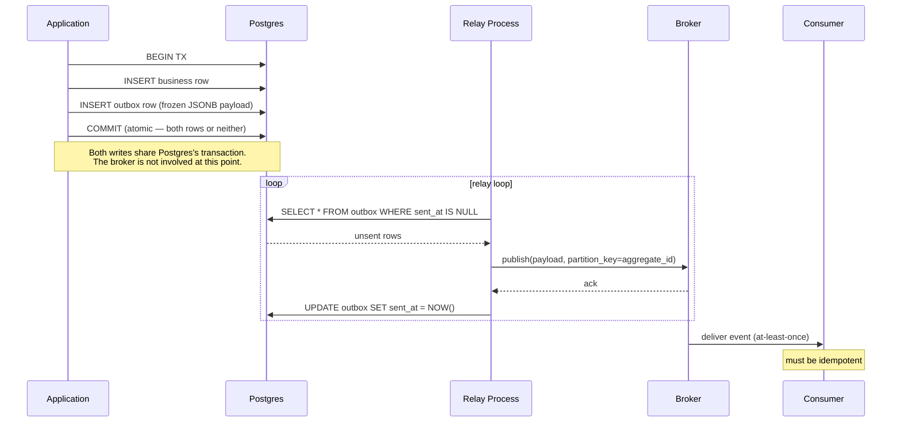

# Outbox: why it comes first

## TL;DR

- **Postgres and a broker cannot share a transaction.** Anything that pretends they can — 2PC, XA — is operationally retired in modern stacks. Don't reach for it; design around it.
- **Outbox uses Postgres's own atomicity** to bind the business write and the *intent to publish* in one transaction, then decouples broker delivery into an asynchronous, retryable relay. Two-system problem reduced to one-system problem plus a retry loop.
- **Outbox payloads must be frozen at write time as JSONB**, not constructed by re-fetching source rows at publish time. Otherwise mutation drift and deletion drift produce wrong or missing events. Frozen payloads also decouple consumers from your DB schema.
- **The pattern enforces three guarantees:** atomic-with-store, at-least-once delivery, per-aggregate ordering. Per-aggregate, not global. Consumers must be idempotent — at-least-once is the standard contract anyway.
- **Outbox is a foundation, not a solution.** It does not address read-side projection lag (CQRS), multi-step cross-service workflows (sagas), or full state replay (event sourcing). Build it first; everything else layers on top.

## Where you started

You came in with the live problem of replacing batch SQL sync jobs (running on a 15–30 minute cron, producing customer-visible timing gaps) with realtime event-driven processing. Concrete pain: an inbound event arrives, your application records it, but downstream associations and enrichments haven't caught up — customers query during the gap, see apparently broken data, complain. By the time support investigates 20+ minutes later, enrichments have completed and the complaint is unreproducible.

You'd heard of outbox but didn't know the term well. You also flagged early in the session that EDA vocabulary in general was uneven, which prompted a calibration adjustment: terms now defined inline, brief glossary at first use.

## The problem — primitives → failure modes

A naive "go realtime" looks like this:

```python
# inside a request handler
with db.transaction():
    db.insert(event_row)            # ① write to Postgres
broker.publish(event_payload)       # ② publish to Kafka/NATS/SQS
```

Both lines, individually, are reliable. Postgres gives you ACID on ①. Your broker gives you at-least-once delivery on ② (assuming durable broker — table stakes). The problem is that **they don't share a transaction.** Postgres knows nothing about the broker; the broker knows nothing about Postgres. Between line ① and line ②, your process is the only thing holding the two together — and your process is mortal.

Concretely:

```
                    Failure modes of naive commit + publish

  ┌─────────────┐                    ┌─────────────┐
  │  Postgres   │                    │   Broker    │
  └─────────────┘                    └─────────────┘
        ▲                                  ▲
        │ ①                                │ ②
        └────────────┬─────────────────────┘
                     │
              ┌───────────────┐
              │  app process  │
              └───────────────┘

  (a) ① commits, then process crashes before ② is even attempted.
      → Row exists. Event never sent. Forever lost.
  (b) ① commits. ② is attempted, but broker is unreachable.
      → Row exists. Publish hangs/errors. Retry has its own failure modes.
  (c) Reverse order: ② succeeds, then ① fails (constraint, deadlock, OOM).
      → Phantom event for a row that doesn't exist.
  (d) ② succeeds, app crashes before marking "I sent it" anywhere.
      → On restart: did it send? Unknown. Retry duplicates. Don't retry,
        risk loss.
```

Failure (a) is the silent killer at scale: rare per request, inevitable in aggregate, no exception in your logs. The row sits there with no event; you discover it days later when a downstream system is missing data.

This is the problem outbox specifically exists for.

### Side-trip: why 2PC / XA isn't the answer

The textbook response is two-phase commit (2PC) and the XA protocol. Quick orientation:

- A *coordinator* asks both systems "can you commit?" — phase 1 (**prepare**). Both vote.
- If both voted yes, coordinator tells both to commit — phase 2 (**commit**). If either voted no, both abort.

Why it's effectively dead in modern stacks:

- The **coordinator is a single point of failure.** Crash between phase 1 and phase 2 → both systems stuck in "prepared" state holding locks, waiting forever.
- **Slow** — multi-round-trip per transaction.
- **Brokers don't seriously implement XA** — Kafka, NATS, SQS lack production-grade XA. You'd be plumbing a homegrown coordinator.
- **Modern consensus** (DDIA 2nd ed., microservices.io, event-driven.io) is unanimous: don't reach for 2PC. Embrace eventual consistency. Use outbox/CDC for atomicity-with-broker. Use sagas for multi-step workflows.

You'll see "2PC" and "XA" referenced in older content. Treat them as historical context, not a tool to reach for.

## The pattern

### Mechanism

The application code, *in the same transaction as the business write*, constructs the full event payload as serialized JSON and inserts it into an outbox table. A separate **relay process** reads from that table and forwards events to the broker.

*Figure: Outbox flow. Atomic in Postgres; asynchronous to the broker.*



The conceptual hinge: **you can't make Postgres and a broker atomic together. Period.** They're separate systems with separate logs. Outbox doesn't try. It uses Postgres's *own* atomicity to bind the business write and the "I owe an event publish" record, then handles broker delivery as an eventual side-effect with retries.

Two-system problem → one-system problem (just Postgres) + a retry loop.

### Three invariants outbox enforces

1. **Atomic with the transactional store.** The business write and the outbox row commit together or not at all. Postgres guarantees this. No coordinator needed.
2. **At-least-once delivery to the broker.** The relay retries until the outbox row is marked sent. If the relay crashes *after* publishing but *before* marking sent, it'll publish again on restart. Consumers must be idempotent — but at-least-once is the standard broker contract anyway, so this isn't extra work.
3. **Per-aggregate ordering.** Partition the outbox by aggregate (a column `aggregate_id` — a feed event id, a customer id, a logistics-unit id) and have the relay read rows in commit order per aggregate. Downstream consumers see events for a given aggregate in the order the application produced them. Across aggregates there's *no* global ordering guarantee — and you mostly don't want one. Global ordering kills throughput; almost no real consumer logic needs it.

### Canonical schema

```sql
CREATE TABLE outbox (
    id                BIGSERIAL PRIMARY KEY,         -- sequencing within the table
    aggregate_id      TEXT NOT NULL,                 -- partition key for ordering
    event_type        TEXT NOT NULL,                 -- "FeedEventReceived", "OrderUpdated", etc.
    payload           JSONB NOT NULL,                -- frozen at write time. self-contained.
    occurred_at       TIMESTAMPTZ NOT NULL DEFAULT NOW(),
    sent_at           TIMESTAMPTZ NULL,              -- NULL until relay publishes
    attempts          INTEGER NOT NULL DEFAULT 0,    -- relay bookkeeping
    last_attempted_at TIMESTAMPTZ NULL               -- alerting / debugging
);

-- Partial index keeps the unsent-row scan cheap as the table grows
CREATE INDEX outbox_unsent_idx ON outbox (id) WHERE sent_at IS NULL;
```

Two design choices worth naming:

- **No `data_source_table` reference column.** The payload is the source of truth for what was published. The outbox doesn't need to know where the data came from; the relay never re-fetches the source row.
- **The partial index** (`WHERE sent_at IS NULL`) is the production trick that keeps polling cheap. With 10M total rows but only 50 unsent, the planner only walks 50. Without the partial index, your relay's `SELECT WHERE sent_at IS NULL` becomes increasingly expensive as the table grows. Common production pitfall.

### Why payloads must be frozen, not re-fetched

A common misstep: design the outbox row to reference the source row (`data_source_table = 'orders'`, `pk = 42`), and have the relay fetch the source row at publish time to construct the payload.

Two failure modes kill this design:

1. **Mutation drift.** The relay polls 5 minutes after the row was queued (backlog, deploy stall, brief broker partition). It does `SELECT * FROM orders WHERE id = 42` to construct the payload. Meanwhile, the row has been updated. The published event reflects state-at-publish-time, not state-at-queue-time. Downstream consumers receive a falsified record of what actually happened.
2. **Deletion drift.** The source row was deleted between queue and publish. The relay has no payload to send — the event is lost or shipped as a stub.

**Freeze the payload as JSONB at write time** and these vanish. As a bonus:

- **Schema independence.** Consumers don't need to know your internal DB schema. Refactor the source table without touching consumer code.
- **Reproducibility.** Replaying historical events into a new consumer (e.g., backfilling a new analytics service) gives faithful events, not whatever the source tables happen to look like *now*.

The instinct that catches the same problem from another angle: **every state change should be its own event.** Inserts queue Created events, updates queue Updated events, deletes queue Deleted events. Each event is frozen at its moment. (This generalizes toward event sourcing — covered in lesson 3.)

## Tradeoffs

### Polling vs CDC — how the relay actually reads

| Axis | Polling | CDC (Debezium-style) |
|---|---|---|
| **Latency** | poll interval (100ms–1s typical) | sub-100ms, often <50ms |
| **DB load** | one query per poll, grows with rate | ~zero (consumes logical replication stream) |
| **Infrastructure** | none beyond your app | Debezium + Kafka Connect (or equivalent) running somewhere |
| **Operational complexity** | low — just another process to monitor | medium-high — replication slots, connector lifecycle, schema-registry concerns |
| **Failure visibility** | obvious (relay logs, lag in `outbox` table) | subtle (replication slot fills disk, connector silently lags) |
| **At rest** | outbox grows; partial index keeps it cheap | can delete rows after publish without losing history (CDC already saw them) |
| **Best fit** | starting out, modest volumes, no existing Kafka Connect | high volume / strict latency, or Kafka Connect already running |

**Default to polling.** Switch to CDC only when one of these is measurably true:

1. **Latency requirement breaks polling** — a consumer needs sub-100ms p99 reactions.
2. **DB load from polling is a constraint** — sustained tens-of-thousands events/sec, polling query in your top-10 slow queries.
3. **You already run Kafka Connect / Debezium** for other CDC use cases — the marginal cost of one more connector is small.

If none of those is true, CDC is a complexity tax for no real benefit.

### "Raw CDC" / transactionless CDC — why not

The pitch: skip the outbox table entirely. Tail business tables directly with Debezium. Every `INSERT/UPDATE/DELETE` becomes an event.

Reject. Same coupling problem as the "fetch payload at publish time" mistake: **events are coupled to your internal DB schema.** Renaming a column is a breaking change for every consumer. Splitting a table is a breaking change. Events have no domain meaning — they're row deltas, not "something happened in the business."

Modern preference: **outbox + CDC > raw CDC.** The outbox table is the event contract; CDC is the cheap way to read from it.

### Where outbox stops being enough

Outbox is *narrow*. It does one thing well: atomic event emission from a single service's transaction. Three classes of problem live outside its scope.

| Pattern | Solves | Enters when |
|---|---|---|
| **Outbox** | Atomic event emission from a single service's transaction | You go event-driven at all |
| **Saga** | Multi-step workflows across services, with compensation | A workflow spans >1 service |
| **Event sourcing** | Full history, audit, event replay | Audit/replay is a first-order requirement (not nice-to-have) |
| **CQRS** | Read-side denormalization & projection from events | Reads need joining/enrichment beyond what source tables give cheaply |

These layer. A mature event-driven system runs **outbox in every service**, **sagas for cross-service workflows**, **CQRS projections for customer-facing reads**, and **event sourcing only for the subset of domains that genuinely need it**. Outbox is the foundation; the rest stack on top.

- **Sagas** (lesson 2): two flavors. *Choreographed* — each service listens for events, emits the next event, no central coordinator. *Orchestrated* — a state machine drives each step. Both build on outbox.
- **Event sourcing** (lesson 3): events become the source of truth; current state is a derivation. Operationally expensive. The field has cooled on it for general-purpose use; it's now reserved for finance, compliance, regulator-facing systems where audit/replay is first-order.
- **CQRS** (lesson 3): writes through the transactional model; reads from a separate, optimized projection. Introduces the *projection lag* problem (the gap between "event published" and "projection updated") — addressed via sealed/ready markers, freshness timestamps, or read-your-writes redirection.

## Pain-point reconnection

Translating the patterns back to the entry-state of the session:

### Pain #1 — customer reads partial state during the enrichment window

**What outbox solves:** the underlying event pipeline. Today's 15–30 minute cron lag collapses to seconds when the ingestion service emits feed events via outbox and an enrichment consumer subscribes immediately.

**What outbox does NOT solve:** the customer-visibility window itself. Even at 2-second latency, a customer querying during those 2 seconds still sees partial state. Outbox makes the window narrower, not zero.

The actual fix has two layers:

1. **Sealed/ready markers in the read path** (CQRS, lesson 3). The customer-facing query doesn't expose a record until expected enrichments have arrived. Trades latency for completeness — the right trade given the support story.
2. **Event log retention for support reproducibility.** *Outbox enables this directly.* Don't delete `sent_at IS NOT NULL` rows; let them accumulate (or archive after 30 days). Now support can query "what events for aggregate X arrived before time T?" and reconstruct the customer's view at the moment of complaint. The "20 minutes later it's all enriched and we can't repro" problem evaporates.

**Concrete first moves, in order of cost:**

- *Cheapest, ships in days:* surface a freshness / "as of" timestamp in the existing customer-facing view. Even pre-CQRS. Customers seeing "this view is from 12 seconds ago, pending 2 enrichments" lose trust *much* less than customers seeing silently incomplete data.
- *Medium, ships with outbox:* keep outbox rows around as the event log. Wire support tooling to query it.
- *Bigger, lesson 3 territory:* CQRS read model with sealed markers.

### Pain #2 — consumer down, messages backlog

**What outbox solves:** nothing. This is broker/consumer-side; outbox is producer-side.

**What actually solves it:**

1. **Durable broker.** Kafka, NATS-JetStream, SQS, RabbitMQ-with-quorum — they all retain messages until consumers ack. Table stakes; you don't pick a broker without it.
2. **Consumer lag as an SLO.** The actual lever. Track it (Kafka consumer-group lag; JetStream pending counts; SQS `ApproximateAgeOfOldestMessage`). Alert on threshold breach. Turns a 20-minute customer complaint into a 60-second page.

Operational, not architectural. Build from day one. Lesson 4 will weight lag observability heavily as a broker-selection criterion.

### Async latency is a property, not a bug

Queues take time to propagate. That's the cost of decoupling, not a problem to fix. The customer-experience question: does your product **surface** the latency (freshness stamps, "processing… will appear in 30 seconds") or **hide** it (optimistic UI updates with reconciliation)? Either is fine. The wrong move is to pretend it isn't there.

### Migration sequence for the realtime-feeds shift

| Stage | What ships | Pain it addresses | Pattern |
|---|---|---|---|
| **1.** | Outbox in the ingestion service: feed events publish in ~1s | Closes the 15–30 min event-emission gap | Outbox + polling relay |
| **2.** | Consumer service for association/enrichment, with its own outbox | Replaces the cron job; enrichment runs in seconds | Outbox + consumer + idempotency |
| **3.** | Freshness stamps in the customer-facing read path | Customers see honest staleness, not silent partial state | Product / read-path fix |
| **4.** | Consumer-lag SLO + alerting | Catches "consumer down" before customers do | Operational |
| **5.** | CQRS read model with sealed markers | Eliminates partial-state customer reads | Lesson 3 |
| **6.** | Migrate relay polling → CDC, if volume/latency justifies | Lower DB load, lower latency | This lesson |

Stages 1–4 use only what we covered in this lesson. Stages 5–6 are subsequent lessons. **Event sourcing is not on this list** — your domain is "ingest, enrich, expose," not "audit and replay arbitrary state." Don't get pulled into it.

## Q&A

**Q: Define "outbox" — used a lot and I wasn't sure I knew the term.**
A: A table in your application's primary database that you insert event rows into as part of the same transaction that mutates your business data. A separate process (the *relay* or *publisher*) reads from that table and forwards the events to whatever broker downstream consumers subscribe to. The pattern's whole purpose is to bridge "I committed a business change" and "the rest of the world knows about it" without losing events or making up phantom ones.
**Calibration note (honest failure):** this exchange revealed an early miss in the lesson. The system used "outbox" several times before defining it, despite the profile signaling no production EDA depth. Future EDA lessons should *lead with vocabulary calibration* regardless of the learner's seniority in adjacent areas. Captured in the profile as an anti-preference update.

**Q: What can go wrong with a naive `commit + publish`?**
A: The learner answered with three real production scenarios — async-latency consequences, eventual-consistency window in the read path, consumer downtime — all real but distinct from the dual-write problem. The dual-write problem itself is the thin window between Postgres committing and `broker.publish()` returning: a process crash, network partition, or transaction rollback after publish (depending on order) leaves the systems inconsistent. Statistically rare per request, inevitable at scale, and silent — no exception in your logs.

**Q: Gut instinct for making ① and ② atomic — staging area with flags. But that just kicks the failure point down the road, doesn't actually guarantee both succeeded.**
A: Validated 80%. The staging-area instinct *is* outbox. The self-critique landed on the conceptual hinge: outbox does NOT make Postgres-and-broker atomic together. It uses Postgres's own atomicity to bind business-write + intent-to-publish, and treats broker delivery as a retryable side-effect. You can't atomic-commit Postgres and a broker; the trick is to use Postgres for what it IS atomic for (its own table), then handle the broker side asynchronously.

**Q: What can change in 5 min between queue and publish that makes the published event wrong?**
A: Both failure modes correctly identified: (1) **mutation drift** — source row updated between queue and publish, the relay fetches current state instead of state-at-queue-time, downstream consumers see modified rather than original data; (2) **deletion drift** — source row gone before publish, no payload to send. Both eliminated by freezing the payload as JSONB at write time. The instinct to "queue an audit-log/updated-by event for the modification" anticipated the event-sourcing premise: every state change should be its own event.

**Q: Sketch the outbox schema.**
A: The learner sketched: `data_source_table | pk | queued_time | sent_time/succeeded | retries/last_tried`. Solid operational columns — leading with "did this thing work, what's our retry posture" is a senior-engineer instinct worth keeping. Missing: `event_type` (consumers subscribe by type, not by source-table-of-origin) and `aggregate_id` (the partition key for per-aggregate ordering). Pushed back on the `data_source_table` reference approach because it implies fetch-at-publish (mutation/deletion drift). Canonical schema landed above.

## Open threads

- **Broker selection** — Kafka vs NATS-JetStream vs Redis Streams vs SQS for the realtime-feeds migration. Now urgent given the migration timeline. Lesson 4.
- **CQRS read-side patterns** — sealed/ready markers, freshness stamps, read-your-writes redirection. Direct fix for the customer-visibility pain. Lesson 3.
- **Saga patterns** — orchestrated vs choreographed. Becomes relevant once feed-processing has multi-stage workflows with compensation. Lesson 2.
- **Event-sourcing decision framework** — when audit/replay is genuinely first-order, vs when it's hype. Lesson 3 makes this explicit.
- **Migration sequencing** — the 6-stage plan above will need more granular planning when actually executed (per-stage SLOs, deployment ordering, rollback strategy).
- **The "lead with vocabulary in new domains" meta-lesson** — captured as a profile anti-preference.

## Retrieval prompts

```
Q:: What is the dual-write problem?
A:: When an application commits a row to a database and then publishes an event to a broker, the two systems don't share a transaction; one can succeed and the other fail, leaving the systems inconsistent (row exists with no event, or phantom event for a non-existent row).

Q:: Name the three concrete reasons 2PC/XA is retired from modern event-driven systems.
A:: (1) Coordinator is a single point of failure — if it crashes between phases 1 and 2, both systems are stuck in "prepared" state holding locks. (2) Slow — multi-round-trip per transaction. (3) Brokers (Kafka, NATS, SQS) don't seriously implement XA; you'd be plumbing a homegrown coordinator.

Q:: What three invariants does outbox enforce?
A:: Atomic with the transactional store (business write + outbox row commit together); at-least-once delivery to the broker (relay retries until sent); per-aggregate ordering (events for the same aggregate published in commit order).

Q:: Why must the outbox payload be frozen at write time rather than re-fetched at publish time?
A:: Two failure modes: (1) mutation drift — the source row may be modified between queue and publish, so the published event reflects later state, not the state at the moment the event was queued. (2) deletion drift — the source row may be gone before publish, leaving no payload. Freezing as JSONB eliminates both and decouples consumers from your DB schema.

Q:: What does the partial index `CREATE INDEX outbox_unsent_idx ON outbox (id) WHERE sent_at IS NULL` achieve?
A:: Keeps the relay's "find unsent rows" query cheap as the table grows. Without it, the `WHERE sent_at IS NULL` scan becomes increasingly expensive. The partial index only contains the small unsent set.

Q:: When should you pick CDC over polling for the relay?
A:: Only when one of: (a) latency requirements break polling (sub-100ms p99), (b) DB load from polling is becoming a constraint, or (c) you already run Kafka Connect / Debezium for other reasons. Default to polling; switch only when measurement says to.

Q:: What's wrong with "skip the outbox table and just have Debezium tail our business tables directly"?
A:: Couples consumer event shapes to your internal DB schema — column renames or table splits become breaking changes for every consumer. The outbox table is your event contract; CDC is just the cheap way to read from it. Modern preference is outbox + CDC, not raw CDC.

Q:: Outbox doesn't solve a customer reading partial state during the enrichment window. What pattern does, and what's the specific mechanism?
A:: CQRS with sealed/ready markers on the read model — the customer-facing projection doesn't expose a record until expected enrichments have arrived. Trades small added latency for completeness. Cheaper pre-CQRS first move: surface an "as of" freshness timestamp so customers see honest staleness instead of silent partial state.

Q:: A consumer was down for 6 hours during a deploy. With a durable broker, what's the actual production concern, and what operational practice addresses it?
A:: Data isn't lost — the broker retains messages until consumed. The concern is that no one knew the consumer was behind until customer complaints. Track consumer lag as an SLO (Kafka consumer-group lag, JetStream pending counts, SQS ApproximateAgeOfOldestMessage) and alert on threshold breach. Turns a 20-minute customer complaint into a 60-second page.

Q:: A multi-step workflow spans 3 services with required compensation if step 2 fails. Does outbox solve this? If not, what does, and how does it relate to outbox?
A:: Outbox doesn't solve this — it assumes one transaction in one service. The successor pattern is sagas (choreographed or orchestrated). Sagas don't replace outbox; they layer on top — each service uses its own outbox to emit events reliably, and the saga coordinates the workflow across services using those events.
```

## Sources

**[from-training, verify]** — Tool-grounded retrieval was *not* performed during this session; claims below are sourced from training plus the curated `primer/source-canon.md` allowlist. Re-verify before acting on specific version/API claims.

- microservices.io — Transactional Outbox pattern: https://microservices.io/patterns/data/transactional-outbox.html — canonical pattern reference.
- event-driven.io (Oskar Dudycz) — current voice on event-driven pragmatics: https://event-driven.io/
- Debezium docs — CDC + outbox-pattern reference implementation: https://debezium.io/documentation/
- Microsoft Azure Architecture Center — outbox / CQRS / saga patterns: https://learn.microsoft.com/azure/architecture/patterns/
- Kleppmann & Riccomini, *Designing Data-Intensive Applications* 2nd ed. — dual-write problem framing, eventual consistency: https://www.oreilly.com/library/view/designing-data-intensive-applications/9781098119058/

## Next

In priority order for the realtime-feeds migration:

1. **`kafka-vs-nats-vs-redis-streams`** *(lesson 4)* — broker selection. Migration timeline pressures it; weighted heavily by lag observability and durability per the operational concerns above.
2. **`sagas-orchestrated-vs-choreographed`** *(lesson 2)* — multi-stage workflows with compensation. Layered on top of outbox.
3. **`when-to-actually-event-source`** *(lesson 3, optional)* — calibration against hype. Honest answer is "rarely needed for ingest-enrich-expose." ~30 min when curiosity wins, not urgent.
