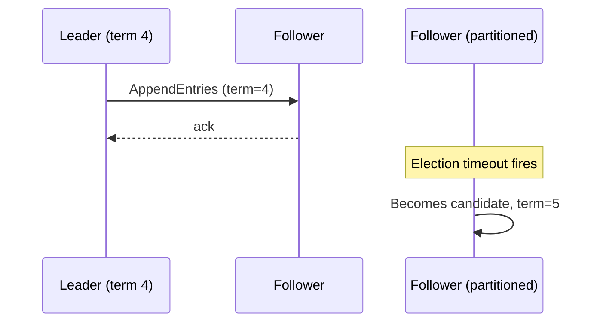

# Visuals — Mermaid + ASCII Conventions

Lessons are text-native. Visuals are first-class but constrained: they must render in (a) a terminal session and (b) GitHub-rendered markdown. No images in v1.

## Mermaid (artifact-side)

Use Mermaid for:

- Sequence diagrams (request flows, consensus rounds, saga choreography).
- State diagrams (replication state, leader-follower transitions).
- Flowcharts (decision trees, branching pattern selection).
- Entity-relationship sketches when domain modeling matters.

GitHub renders Mermaid blocks natively. Always include a one-line caption above each block.

````markdown
*Figure: Raft leader election under network partition.*


````

## ASCII (terminal-side)

Use ASCII for:

- Inline diagrams during the live conversation, where Mermaid wouldn't render.
- Quick sketches the learner asks for ("show me the layout").
- Tables of small data.

Style: Unicode box-drawing characters (`┌─┐│└┘├┤┬┴┼` and arrows `→ ← ↑ ↓`) — they render in any modern terminal and copy cleanly into markdown.

```
   ┌──────────┐  AppendEntries  ┌──────────┐
   │  Leader  │ ──────────────▶ │ Follower │
   └──────────┘  ◀── ack ────── └──────────┘
        │
        │ replicates to majority
        ▼
   commit index advances
```

When the artifact needs both — render Mermaid in the artifact and ASCII inline during the session.

## Tables for tradeoffs

For tradeoff comparisons, prefer markdown tables. They render everywhere and grep cleanly.

| Pattern | Operational cost | Latency | Consistency | When to reach for it |
|---|---|---|---|---|
| Outbox | Low | Low | Eventual | Default. Use this first. |
| CDC | Medium | Low | Eventual | When you can't change app code. |
| Saga (orchestrated) | High | High | Eventual | True cross-service workflows. |

## Anti-patterns

- Drawing what could be a table. If the data is rows-and-columns, use a table.
- Mermaid diagrams without captions. Every figure has a label.
- Decorative emoji. Reserved characters (`✓ ✗ →`) for content-bearing meaning are fine; smiley faces are not.
- Generating images. Out of scope for v1. If a concept truly needs an image, link to an authoritative external source.
